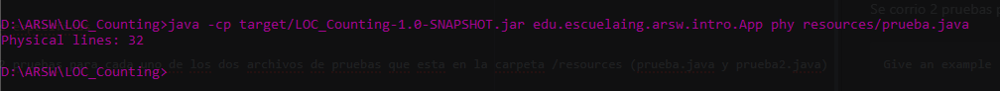
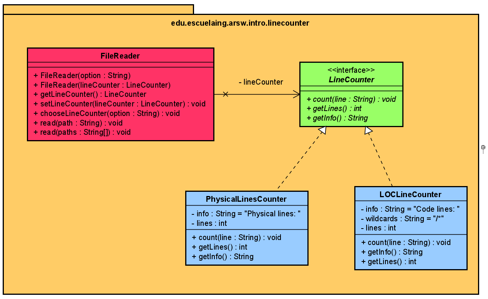

# LOC Counting

Esta aplicación permite contar las líneas físicas y de código java existentes en un archivo, dando parámetros por la terminal

## Articulo del Proyecto:


## Para empezar

Se debe ejecutar en la carpeta raiz
```
git clone https://github.com/AriasAEnima/LOC_Counting.git
```
### Prerrequisitos

Java Jdk 1.8, Maven y Git.

### Instalación

Primero ejecutamos maven en la carpeta raiz

```
mvn package
```

## Desarrollo

Para correr por terminal :

```
> java -cp target/LOC_Counting-1.0-SNAPSHOT.jar edu.escuelaing.arsw.intro.App <opt> <path>

```

### Pruebas especificas
Estas pruebas se correrán cada vez que se ejecute mvn package.
Se corrió 2 pruebas para cada uno de los dos archivos de pruebas que esta en la carpeta /resources (prueba.java y prueba2.java)
y se compararon los resultados numéricos con los esperados, lo que seria equivalente a:

```
java -cp target/LOC_Counting-1.0-SNAPSHOT.jar edu.escuelaing.arsw.intro.App phy resources/prueba.java
```


Tanto con el archivo prueba.java y prueba2.java , con la opcion phy y loc.


## Construido

* [JAVA JDK 8](http://www.oracle.com/technetwork/java/javase/overview/index.html) - Version de Java
* [Maven](https://maven.apache.org/) - Maven
* [JUnit 3.8.1](https://mvnrepository.com/artifact/junit/junit/3.8.1) - Para Pruebas


## Autor

* **J. Eduardo Arias Barrera** - *Initial work* - [AriasAEnima](https://github.com/AriasAEnima)

## Diseño Utilizado



## Licencia

This project is licensed under the GNU General Public License - see the [LICENSE](LICENSE) file for details
